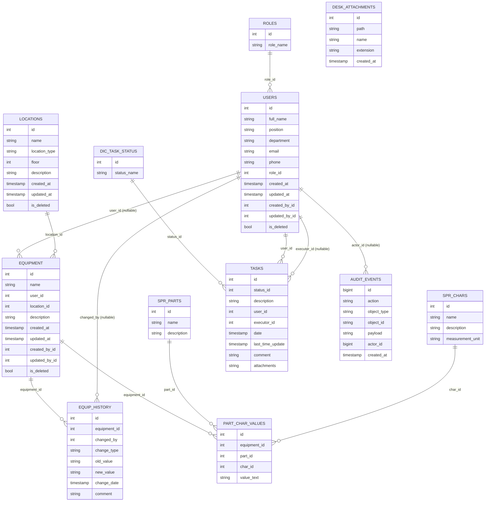

Задача: Проанализировать два SQL-дампа (старая и новая версия одной БД) и спроектировать целевую структуру базы данных для загрузки данных из Excel-файла основного учета предметной области.

Контекст:

У меня есть два SQL-дампа одной БД от разных версий приложения (например, dump_v1.sql и dump_v2.sql)

Цель — понять эволюцию схемы данных и спроектировать оптимальную целевую БД

Целевая БД должна эффективно хранить данные из Excel-файла основного учета (например: товары, транзакции, клиенты, склады и т.д.)

Требуемые действия:

Этап 1: Анализ дампов

Сравни две версии БД и выдели:

Добавленные/удаленные таблицы

Измененные столбцы (типы данных, ограничения)

Новые/удаленные индексы, внешние ключи

Изменения в триггерах, процедурах, представлениях

Определи основную предметную область (например, складской учет, бухгалтерия, CRM)

Выяви ключевые сущности и их атрибуты в каждой версии

---

## Результаты этапа 1: Анализ дампов

**Используемые дампы:** `db/ias_uch_vnii_db.sql` (v1, legacy, Yii2/PHP) и `db/ias_vnii_db.sql` (v2, текущая схема ИАС). Оба — PostgreSQL 17.4, pg_dump 17.6.

### 1. Добавленные и удалённые таблицы

| Изменение | Таблица | Описание |
|-----------|---------|----------|
| **Переименовано** | arm → equipment | Оборудование/АРМ: прежняя сущность, новое имя и стиль полей (id, user_id, location_id). |
| **Переименовано** | arm_history → equip_history | История изменений оборудования: id_arm → equipment_id, id_history → id. |
| **Переименовано** | spr_char → spr_chars | Справочник характеристик: id_char → id. |
| **Добавлено** | software | Учёт программного обеспечения (name, vendor, description). |
| **Добавлено** | licenses | Лицензии ПО (key, valid_from, valid_to, seats, comment, software_id). |
| **Добавлено** | software_installs | Установки ПО на оборудование (equipment_id, software_id, version, installed_at, installed_by_id, license_id). |
| **Добавлено** | audit_events | Аудит действий (action, object_type, object_id, payload, actor_id, created_at, request_id, ip, user_agent). |
| **Добавлено** | auth_group, auth_permission, auth_group_permissions | Группы и права (в дампе ias_vnii_db — следы другого стека; при работе на PHP не используются). |
| **Добавлено** | django_admin_log, django_content_type, django_migrations, django_session | Служебные таблицы (в дампе ias_vnii_db; при работе на PHP не используются). |

Таблицы **users**, **roles**, **locations**, **tasks**, **dic_task_status**, **desk_attachments**, **spr_parts**, **part_char_values**, **migration** присутствуют в обеих версиях (в v2 — с переименованными столбцами и единым стилем имён).

### 2. Изменённые столбцы (типы, ограничения)

| Таблица | v1 (ias_uch_vnii_db) | v2 (ias_vnii_db) |
|--------|----------------------|------------------|
| **Оборудование** | arm: id_arm, id_user, id_location | equipment: id, user_id, location_id |
| **История** | arm_history: id_history, id_arm, change_date | equip_history: id, equipment_id, change_date |
| **Заявки** | tasks: id_status, id_user | tasks: status_id, user_id |
| **Пользователи** | users: id_user, id_role | users: id, role_id |
| **Локации** | locations: id_location | locations: id |
| **Справочники** | dic_task_status: id_status; spr_char: id_char; spr_parts: id_part; part_char_values: id_part_char, id_part, id_char, id_arm | dic_task_status: id; spr_chars: id; spr_parts: id; part_char_values: id, part_id, char_id, equipment_id |
| **Вложения** | desk_attachments: attach_id | desk_attachments: id |
| **tasks** | attachments text | attachments text (без изменения; в данных — JSON-массив ID вложений) |
| **locations** | — | Без изменения структуры; CHECK chk_location_type сохранён |
| **users** | auth_key, access_token, password_reset_token (Yii2) | В v2 могут быть опущены или перенесены в слой приложения |

Типы данных по сущностям не менялись: integer PK/FK, varchar с теми же длинами, text, timestamp. В v2 для audit_events и части служебных таблиц используются bigint и timestamp with time zone.

### 3. Индексы и внешние ключи

**Внешние ключи (v1):**  
arm → users, locations; arm_history → arm, users; part_char_values → arm, spr_parts, spr_char; tasks → dic_task_status, users; users → roles. В v1 нет FK для tasks.executor_id и связи desk_attachments с tasks (только логическая по attachments).

**Внешние ключи (v2):**  
equipment → users, locations; equip_history → equipment, users; part_char_values → equipment, spr_parts, spr_chars; tasks → dic_task_status, users (executor_id без FK); software_installs → software, licenses, users (equipment_id без FK к equipment); audit_events → users. Таблицы auth_* и django_* в дампе v2 к доменной схеме не относятся; при целевой схеме для PHP (ias_uch_db_test) не включаются.

**Индексы:**  
В v1: idx_desk_attachments_name, idx_tasks_executor_id. В v2 сохранены те же два плюс индексы для audit_events (action, actor_id, created_at, object_type/object_id, request_id), для licenses (software_id, valid_to), для software (name, vendor), для software_installs (equipment_id, software_id, installed_at, installed_by_id, license_id), для auth_* и django_*.

### 4. Триггеры, процедуры, представления

В обоих дампах **триггеры, хранимые процедуры и представления отсутствуют**. Только таблицы, последовательности, ограничения и индексы.

### 5. Предметная область

**Основная предметная область:** учёт технических средств (оборудования, АРМ) организации и смежные процессы.

- **Ядро:** активы (equipment/arm), привязка к ответственным (users) и локациям (locations), характеристики по типам комплектующих (spr_parts, spr_chars, part_char_values), история изменений (equip_history).
- **Сервис:** заявки (tasks, dic_task_status, desk_attachments).
- **Расширение в v2:** учёт ПО и лицензий (software, licenses, software_installs), аудит действий (audit_events).

Целевая БД для загрузки из Excel «Основной учёт» ориентирована на это ядро: оборудование, локации, пользователи, при необходимости — справочники и история.

### 6. Ключевые сущности и атрибуты по версиям

**v1 (ias_uch_vnii_db):**

| Сущность | Ключ | Основные атрибуты |
|----------|------|-------------------|
| arm | id_arm | name, id_user, id_location, description, created_at |
| arm_history | id_history | id_arm, changed_by, change_type, old_value, new_value, change_date, comment |
| users | id_user | full_name, position, department, email, phone, password, id_role, auth_key, access_token, password_reset_token |
| roles | id_role | role_name |
| locations | id_location | name, location_type, floor, description |
| tasks | id | id_status, description, id_user, executor_id, date, last_time_update, comment, attachments |
| dic_task_status | id_status | status_name |
| desk_attachments | attach_id | path, name, extension, created_at |
| spr_parts | id_part | name, description |
| spr_char | id_char | name, description, measurement_unit |
| part_char_values | id_part_char | id_part, id_char, value_text, id_arm |

**v2 (ias_vnii_db):**  
Те же сущности с переименованными таблицами/полями (equipment, equip_history, spr_chars; id, user_id, location_id, status_id, role_id и т.д.) плюс **software** (id, name, vendor, description), **licenses** (id, key, valid_from, valid_to, seats, comment, software_id), **software_installs** (id, equipment_id, software_id, version, installed_at, installed_by_id, license_id), **audit_events** (id, action, object_type, object_id, payload, actor_id, created_at, request_id, ip, user_agent). Таблицы auth_* и django_* к домену учёта техсредств не относятся.

---

Детальное описание схемы v2, загрузки из «Основной Учет.xlsx» и скриптов восстановления БД см. в документе `docs/АНАЛИЗ_ДАМПА_И_ЗАГРУЗКА_ДАННЫХ.md`.

---

Этап 2: Анализ Excel-файла (предполагаемая структура)

Предположи, что Excel-файл содержит:
- Листы с данными (например: «Оборудование», «Локации», «Пользователи»)
- Связи между листами (инв. номер / наименование техсредства, ФИО ответственного, кабинет/локация)
- Исторические данные с временными метками (дата постановки на учёт, дата перемещения)
- Справочники (типы комплектующих, характеристики с единицами измерения, роли, типы локаций)

**Результаты этапа 2: предполагаемая структура «Основной Учет.xlsx»**

Предметная область — учёт технических средств предприятия, поэтому содержимое файла ориентировано на активы, места размещения и ответственных, а не на товары/продажи/клиентов.

| Элемент | Предполагаемое содержание |
|--------|---------------------------|
| **Листы с данными** | «Оборудование» (наименование, инв. номер, ответственный, кабинет, примечание); «Локации» (название, тип: кабинет/склад/серверная/лаборатория/другое, этаж); «Пользователи» (ФИО, должность, подразделение, email, роль). |
| **Связи между листами** | В листе «Оборудование» — текстовая привязка к ответственному (ФИО) и к месту (название кабинета/локации); при загрузке — поиск по `users.full_name` и `locations.name` для подстановки id. Возможны коды/артикулы типов техники или инв. номера для связи с характеристиками. |
| **Исторические данные** | Столбцы «Дата постановки на учёт», «Дата последнего перемещения» или отдельный лист «История перемещений» (оборудование, старая/новая локация, дата). Временные метки позволяют формировать записи в `equip_history`. |
| **Справочники** | Типы комплектующих (аналог `spr_parts`: процессор, ОЗУ, монитор и т.д.); характеристики с единицами измерения (аналог `spr_chars`: объём памяти ГБ, диагональ ", частота ГГц); роли пользователей; перечень типов локаций (кабинет, склад, серверная, лаборатория, другое). |

Уточнение фактических имён листов и столбцов в «Основной Учет.xlsx» необходимо выполнить по файлу и зафиксировать в скрипте загрузки и в `docs/АНАЛИЗ_ДАМПА_И_ЗАГРУЗКА_ДАННЫХ.md` (раздел 2.3).

---

Этап 3: Проектирование целевой БД
Спроектируй целевую схему БД, которая:

Нормализована до 3НФ (с обоснованием)

Включает:

Все необходимые таблицы с полями (типы данных, ограничения)

Первичные и внешние ключи

Индексы для часто запрашиваемых полей

Таблицы-справочники

Поддерживает:

Историчность данных (версионирование, даты актуальности)

Аудит изменений (кто/когда создал/изменил)

Мягкое удаление (флаг is_deleted)

Оптимизирована для:

Быстрой загрузки данных из Excel

Аналитических запросов (агрегации, фильтрация по периодам)

Интеграции с приложениями

---

## Результаты этапа 3: Проектирование целевой БД

### 3.1. Нормализация до 3НФ (обоснование)

- **1НФ:** все атрибуты атомарны; повторяющиеся группы вынесены в отдельные таблицы (например, значения характеристик — в `part_char_values`, а не в столбцы «характеристика_1», «характеристика_2» в `equipment`).
- **2НФ:** составные первичные ключи отсутствуют; в таблицах со суррогатным `id` все неключевые атрибуты зависят от целого ключа.
- **3НФ:** нет транзитивных зависимостей: ответственный и локация хранятся как ссылки на `users` и `locations`, а не как дублируемые ФИО/название кабинета в `equipment`; справочники (роли, статусы заявок, типы частей, характеристики) вынесены в отдельные таблицы.

Исключения/допущения: поле `tasks.attachments` в текущей схеме хранит JSON-массив ID вложений; для строгой 3НФ допустимо ввести таблицу связи «заявка–вложение». Для загрузки из Excel и отчётности текущая схема достаточна.

### 3.2. Состав схемы: таблицы, поля, ограничения

Целевая схема опирается на **ias_vnii_db** (v2) с дополнениями для историчности, аудита и мягкого удаления.

| Таблица | Назначение | Ключевые поля и ограничения |
|--------|------------|----------------------------|
| **roles** | Справочник ролей | id (PK), role_name. UK по role_name при необходимости. |
| **users** | Пользователи (ответственные) | id (PK), full_name NOT NULL, position, department, email, phone, password, role_id (FK→roles), created_at, updated_at, created_by_id, updated_by_id (FK→users, nullable), is_deleted DEFAULT false. CHECK: full_name не пустой. |
| **locations** | Места размещения | id (PK), name NOT NULL, location_type, floor, description, created_at, updated_at, is_deleted DEFAULT false. CHECK: location_type in (кабинет, склад, серверная, лаборатория, другое). UK по name. |
| **equipment** | Технические средства | id (PK), name NOT NULL, user_id (FK→users), location_id (FK→locations), description, created_at, updated_at, created_by_id, updated_by_id (FK→users), is_deleted DEFAULT false. Индекс по (location_id, is_deleted), (user_id, is_deleted) для отчётов. |
| **equip_history** | История изменений оборудования | id (PK), equipment_id (FK→equipment), changed_by (FK→users), change_type, old_value, new_value, change_date DEFAULT CURRENT_TIMESTAMP, comment. Индекс по (equipment_id, change_date). |
| **spr_parts** | Справочник типов комплектующих | id (PK), name NOT NULL, description. CHECK: name не пустой. |
| **spr_chars** | Справочник характеристик | id (PK), name NOT NULL, description, measurement_unit. UK по name. |
| **part_char_values** | Значения характеристик по оборудованию | id (PK), equipment_id (FK→equipment), part_id (FK→spr_parts), char_id (FK→spr_chars), value_text. UK (equipment_id, part_id, char_id) для исключения дубликатов. Индексы по equipment_id, (part_id, char_id). |
| **dic_task_status** | Статусы заявок | id (PK), status_name NOT NULL. UK по status_name. |
| **tasks** | Заявки | id (PK), status_id (FK→dic_task_status), description, user_id (FK→users), executor_id (FK→users, nullable), date, last_time_update, comment, attachments (text/JSON). Индекс по (status_id, date), executor_id. |
| **desk_attachments** | Вложения к заявкам | id (PK), path, name, extension, created_at. Индекс по name. |
| **software**, **licenses**, **software_installs** | Учёт ПО и лицензий | По текущей схеме ias_vnii_db; при необходимости добавить created_at/updated_at, is_deleted. |
| **audit_events** | Аудит действий | id (PK), action, object_type, object_id, payload (jsonb), actor_id (FK→users), created_at, request_id, ip, user_agent. Индексы по (object_type, object_id), actor_id, created_at. |

Типы данных: целочисленные PK/FK — integer или bigint; строки — varchar с ограничением длины; текст — text; даты/время — timestamp (without/with time zone по необходимости); флаг — boolean.

### 3.3. Историчность, аудит, мягкое удаление

- **Историчность:** таблица `equip_history` хранит изменения оборудования (перемещение, смена ответственного и т.д.) с датой и типом изменения. При необходимости ввести даты актуальности (valid_from, valid_to) для привязки «оборудование–локация» или «оборудование–пользователь» — отдельная доработка схемы.
- **Аудит:** поля created_at, updated_at, created_by_id, updated_by_id в основных таблицах; таблица `audit_events` для журнала действий пользователей (кто/когда/что изменил).
- **Мягкое удаление:** флаг is_deleted (boolean, DEFAULT false) в таблицах users, locations, equipment. В выборках по умолчанию фильтр WHERE is_deleted = false. Восстановление — обновление флага.

### 3.4. Оптимизация под загрузку из Excel, аналитику и интеграцию

- **Загрузка из Excel:** порядок вставки: roles → locations → users → equipment → spr_parts/spr_chars → part_char_values → equip_history. Индексы по натуральным ключам (name в locations, full_name в users) ускоряют поиск при сопоставлении строк Excel с записями БД. Массовая вставка — COPY или batch INSERT с отключением проверок FK на время загрузки (по необходимости).
- **Аналитика:** индексы по (equipment.location_id, is_deleted), (equipment.user_id, is_deleted), (equip_history.equipment_id, change_date), (part_char_values.equipment_id), (tasks.status_id, date), (audit_events.created_at) обеспечивают быструю фильтрацию и агрегацию по периодам и объектам.
- **Интеграция:** единый стиль имён (id, *_id), явные FK и стабильный набор таблиц обеспечивают подключение приложения (PHP/Yii2 или иного) к целевой схеме. Таблицы auth_* и django_* из дампа ias_vnii_db при работе на PHP не используются; целевая схема — ias_uch_db_test без них.

---

Этап 4: Миграция и загрузка

Предложи стратегию: преобразование данных из обеих версий БД в целевую схему; загрузка из Excel по этапам с валидацией; обработка конфликтов (дубликаты, некорректные ссылки); скрипты создания БД, переноса из старых версий, импорта из Excel/CSV.

---

## Результаты этапа 4: Миграция и загрузка

Структура листа **«АРМ»** файла «Основной Учет.xlsx» и рекомендации по неатомарным ячейкам приведены в документе **`docs/СТРУКТУРА_ЛИСТА_АРМ_ОСНОВНОЙ_УЧЕТ.md`**.

### 4.1. Преобразование данных из обеих версий БД в целевую схему

| Источник | Действие |
|----------|----------|
| **ias_uch_vnii_db (v1)** | Маппинг таблиц и столбцов: arm → equipment (id_arm→id, id_user→user_id, id_location→location_id); arm_history → equip_history (id_arm→equipment_id, id_history→id); users, roles, locations — переименование PK/FK (id_user→id, id_role→role_id, id_location→id); spr_char → spr_chars; part_char_values (id_arm→equipment_id, id_part→part_id, id_char→char_id, id_part_char→id). Данные копировать INSERT … SELECT с подстановкой новых имён; при наличии в целевой схеме полей created_at, updated_at, is_deleted — задать значения по умолчанию. |
| **ias_vnii_db (v2)** | Схема уже близка к целевой; при добавлении в целевую схему полей created_at, updated_at, created_by_id, updated_by_id, is_deleted — выполнить ALTER TABLE и обновить существующие строки (например, is_deleted = false, created_at = COALESCE(created_at, CURRENT_TIMESTAMP)). |

Миграционные скрипты: сначала создать целевую БД (DDL из этапа 3), затем скрипты переноса из v1 и при необходимости из v2 с учётом уже загруженных данных (проверка по id или по бизнес-ключу).

### 4.2. Загрузка данных из Excel (лист «АРМ»): поэтапно, с валидацией

1. **Подготовка:** восстановить целевую БД из дампа или DDL; заполнить справочники roles, dic_task_status, при необходимости spr_parts, spr_chars.
2. **Чтение листа «АРМ»:** считать диапазон A1:W792 (23 столбца, 791 строка данных); первая строка — заголовки (Наименование, Поставщик, Дата поступления, Кому поставили, Примечание, Системный блок, ЦП, ОЗУ, Диск, Монитор, Пользователь, Отдел, № монитора, № системн. блока, Инв. Номер, ОС, IP адрес, Имя, Антивирус, Помещение и др. — уточнить по файлу).
3. **Валидация и обогащение справочников:** для каждой строки извлечь помещение (кабинет) и ФИО пользователя; найти или создать запись в locations (по названию), в users (по full_name); при отсутствии — записать в лог и при необходимости создать запись с минимальными данными или пропустить user_id/location_id.
4. **Вставка оборудования:** для каждой строки сформировать запись equipment (name — из инв. номера/наименования, user_id, location_id, description — примечание и/или конкатенация части полей); вставка batch (например, по 100–500 строк) с обработкой ошибок FK.
5. **Обработка неатомарных ячеек (Диск, Монитор, ОЗУ, IP и т.д.):** см. п. 4.3 и `docs/СТРУКТУРА_ЛИСТА_АРМ_ОСНОВНОЙ_УЧЕТ.md`. Варианты: сохранить весь текст в description или в одну запись в part_char_values; либо разбить по разделителям (\n, запятая) и создать несколько записей в part_char_values (тип части «Жесткий диск», «Монитор» и т.д.).
6. **История:** при наличии в Excel даты постановки на учёт — после вставки equipment добавлять записи в equip_history (change_type = «постановка на учёт», new_value = дата).

### 4.3. Обработка конфликтов и неатомарных значений

| Ситуация | Рекомендация |
|----------|--------------|
| **Дубликаты по инв. номеру / name** | Перед вставкой проверять существование записи по инв. номеру (или name); при совпадении — UPDATE вместо INSERT или пропуск с записью в лог. |
| **Некорректные ссылки (ФИО/кабинет не найдены)** | Не создавать запись equipment с несуществующим user_id/location_id; записать строку в лог ошибок (номер строки Excel, значение ФИО/кабинета); опционально — создавать новую локацию/пользователя по правилам заказчика. |
| **Неатомарные ячейки (несколько носителей, 2 монитора в одной ячейке)** | Либо сохранять значение целиком в description или в одно значение характеристики; либо парсить по разделителям (\n, запятая, « и ») и создавать несколько записей в part_char_values для одного equipment_id. См. детально в `docs/СТРУКТУРА_ЛИСТА_АРМ_ОСНОВНОЙ_УЧЕТ.md`. |
| **Пустые обязательные поля** | Поле name (equipment) не пустое — заполнять из инв. номера или наименования; при отсутствии обоих — пропускать строку и логировать. |

### 4.4. Скрипты

| Назначение | Расположение / содержание |
|------------|---------------------------|
| Создание и восстановление БД | `scripts/create_and_restore_db.cmd` — создание БД ias_vnii_db и восстановление из дампа `db/ias_vnii_db.sql`. |
| Перенос данных из старых версий | Отдельный SQL-скрипт или скрипт на PHP: подключение к ias_uch_vnii_db и при необходимости ias_vnii_db, выборка из arm/users/locations/… и вставка в целевую схему с маппингом имён столбцов (см. п. 4.1). |
| Импорт из Excel | `scripts/load_osnovnoy_uchot.py` — шаблон; доработать под фактические имена столбцов листа «АРМ» (см. `docs/СТРУКТУРА_ЛИСТА_АРМ_ОСНОВНОЙ_УЧЕТ.md`) и добавить разбор неатомарных ячеек (разделители \n, запятая), валидацию ссылок на users/locations, обработку дубликатов по инв. номеру. |

---

Этап 5: Документация

Предоставь: ER-диаграмму целевой БД (Mermaid), словарь данных, SQL-скрипт создания БД, примеры запросов для отчётности.

---

## Результаты этапа 5: Документация

### 5.1. ER-диаграмма целевой БД (Mermaid)



### 5.2. Словарь данных (таблица / поле / тип / описание)

| Таблица | Поле | Тип | Описание |
|---------|------|-----|----------|
| roles | id | SERIAL | Первичный ключ |
| roles | role_name | VARCHAR(100) | Наименование роли |
| users | id | SERIAL | Первичный ключ |
| users | full_name | VARCHAR(200) | ФИО (обязательное) |
| users | position | VARCHAR(100) | Должность |
| users | department | VARCHAR(100) | Подразделение |
| users | email | VARCHAR(100) | Эл. почта |
| users | phone | VARCHAR(50) | Телефон |
| users | password | VARCHAR(255) | Пароль (хэш) |
| users | role_id | INTEGER | Ссылка на roles.id |
| users | created_at, updated_at | TIMESTAMP | Дата создания/изменения |
| users | created_by_id, updated_by_id | INTEGER | Кто создал/изменил (FK→users) |
| users | is_deleted | BOOLEAN | Мягкое удаление |
| locations | id | SERIAL | Первичный ключ |
| locations | name | VARCHAR(100) | Название (уникальное) |
| locations | location_type | VARCHAR(50) | кабинет \| склад \| серверная \| лаборатория \| другое |
| locations | floor | INTEGER | Этаж |
| locations | description | TEXT | Описание |
| locations | created_at, updated_at, is_deleted | — | Аналогично users |
| equipment | id | SERIAL | Первичный ключ |
| equipment | name | VARCHAR(200) | Наименование / инв. номер |
| equipment | user_id | INTEGER | Ответственный (FK→users) |
| equipment | location_id | INTEGER | Место размещения (FK→locations) |
| equipment | description | TEXT | Примечание |
| equipment | created_at, updated_at, created_by_id, updated_by_id, is_deleted | — | Аудит и мягкое удаление |
| equip_history | id | SERIAL | Первичный ключ |
| equip_history | equipment_id | INTEGER | Оборудование (FK→equipment) |
| equip_history | changed_by | INTEGER | Кто изменил (FK→users) |
| equip_history | change_type | VARCHAR(50) | Тип изменения (перемещение, постановка на учёт и т.д.) |
| equip_history | old_value, new_value | TEXT | Старое/новое значение |
| equip_history | change_date | TIMESTAMP | Дата изменения |
| equip_history | comment | TEXT | Комментарий |
| spr_parts | id | SERIAL | Первичный ключ |
| spr_parts | name | VARCHAR(100) | Тип комплектующего (Процессор, ОЗУ, Монитор и т.д.) |
| spr_parts | description | TEXT | Описание |
| spr_chars | id | SERIAL | Первичный ключ |
| spr_chars | name | VARCHAR(100) | Название характеристики (уникальное) |
| spr_chars | description | TEXT | Описание |
| spr_chars | measurement_unit | VARCHAR(50) | Единица измерения (ГБ, ГГц, ") |
| part_char_values | id | SERIAL | Первичный ключ |
| part_char_values | equipment_id | INTEGER | Оборудование (FK→equipment) |
| part_char_values | part_id | INTEGER | Тип части (FK→spr_parts) |
| part_char_values | char_id | INTEGER | Характеристика (FK→spr_chars) |
| part_char_values | value_text | TEXT | Значение (может быть неатомарным из Excel) |
| dic_task_status | id | SERIAL | Первичный ключ |
| dic_task_status | status_name | VARCHAR(50) | Статус заявки (уникальное) |
| tasks | id | SERIAL | Первичный ключ |
| tasks | status_id | INTEGER | Статус (FK→dic_task_status) |
| tasks | description | TEXT | Описание заявки |
| tasks | user_id | INTEGER | Автор (FK→users) |
| tasks | executor_id | INTEGER | Исполнитель (FK→users, nullable) |
| tasks | date, last_time_update | TIMESTAMP | Дата создания/обновления |
| tasks | comment | TEXT | Комментарий |
| tasks | attachments | TEXT | JSON-массив ID вложений (legacy) |
| desk_attachments | id | SERIAL | Первичный ключ |
| desk_attachments | path, name, extension | VARCHAR | Путь, имя файла, расширение |
| desk_attachments | created_at | TIMESTAMP | Дата создания |
| audit_events | id | BIGSERIAL | Первичный ключ |
| audit_events | action, object_type, object_id | VARCHAR | Действие, тип объекта, идентификатор |
| audit_events | payload | JSONB | Доп. данные |
| audit_events | actor_id | BIGINT | Пользователь (FK→users) |
| audit_events | created_at | TIMESTAMPTZ | Время события |

### 5.3. SQL-скрипт создания БД

Полный DDL размещён в файле **`scripts/create_target_db.sql`**: создание таблиц roles, users, locations, equipment, equip_history, spr_parts, spr_chars, part_char_values, dic_task_status, tasks, desk_attachments, audit_events с первичными и внешними ключами, ограничениями (CHECK, UNIQUE), индексами для отчётности и загрузки из Excel.

Запуск (после создания БД вручную при необходимости):

```bash
psql -U postgres -d ias_target -f scripts/create_target_db.sql
```

### 5.4. Примеры запросов для отчётности

**Оборудование по локациям (без удалённых):**

```sql
SELECT l.name AS помещение, l.location_type, COUNT(e.id) AS кол_оборудования
FROM locations l
LEFT JOIN equipment e ON e.location_id = l.id AND e.is_deleted = FALSE
WHERE l.is_deleted = FALSE
GROUP BY l.id, l.name, l.location_type
ORDER BY l.name;
```

**Оборудование по ответственным:**

```sql
SELECT u.full_name AS ответственный, u.department AS отдел, COUNT(e.id) AS кол_оборудования
FROM users u
LEFT JOIN equipment e ON e.user_id = u.id AND e.is_deleted = FALSE
WHERE u.is_deleted = FALSE
GROUP BY u.id, u.full_name, u.department
ORDER BY u.full_name;
```

**История перемещений по объекту:**

```sql
SELECT e.name AS оборудование, eh.change_type, eh.old_value, eh.new_value, eh.change_date, u.full_name AS кто_изменил
FROM equip_history eh
JOIN equipment e ON e.id = eh.equipment_id
LEFT JOIN users u ON u.id = eh.changed_by
WHERE e.is_deleted = FALSE
ORDER BY eh.change_date DESC;
```

**Характеристики оборудования (ЦП, ОЗУ, диск, монитор):**

```sql
SELECT eq.name AS оборудование, sp.name AS тип_части, sc.name AS характеристика, pcv.value_text AS значение
FROM part_char_values pcv
JOIN equipment eq ON eq.id = pcv.equipment_id
JOIN spr_parts sp ON sp.id = pcv.part_id
JOIN spr_chars sc ON sc.id = pcv.char_id
WHERE eq.is_deleted = FALSE
ORDER BY eq.name, sp.name, sc.name;
```

**Заявки по статусам за период:**

```sql
SELECT s.status_name, COUNT(t.id) AS кол_заявок
FROM dic_task_status s
LEFT JOIN tasks t ON t.status_id = s.id AND t.date >= :date_from AND t.date < :date_to
GROUP BY s.id, s.status_name;
```

### 5.5. Достаточность ER-диаграммы 5.1 для реализации проекта (система учёта ТС предприятия)

По результатам анализа ТЗ (`TZ.md`), описания системы (`SYSTEM_DESCRIPTION.md`), документации по активам и БД (`docs/ОСНОВНОЙ_УЧЕТ_И_БД.md`, `docs/СРАВНЕНИЕ_ВЕРСИЙ_БД.md`) и текущей схемы:

**Вывод: ER-диаграмма 5.1 достаточна как база (учёт ТС, заявки, пользователи, локации, история, справочники, аудит), но для полной реализации проекта по ТЗ в ней не хватает нескольких сущностей и связей.**

| Требование (ТЗ / домен) | В ER 5.1 | Недостающее |
|------------------------|----------|-------------|
| Учёт активов: карточка, локация, закрепление, история (5.1.5) | Есть: equipment, locations, users, equip_history, part_char_values | Явно не отражены: **инв. номер (UNIQUE)**, **серийный номер**, **эксплуатационный статус** актива (в эксплуатации / на складе / в ремонте / списано), при необходимости — даты (постановка на учёт, гарантия). |
| Поиск активов по инв. номеру, серийному, фильтр по статусу (5.1.8) | Поле name, нет статуса, нет отдельного inv/serial | Добавить в equipment: **inventory_number** (UNIQUE), **serial_number**, **status_id** → справочник статусов оборудования (или поле status). |
| Связь заявки с активом — один или несколько (5.1.6) | Связи TASKS ↔ EQUIPMENT нет | **Связь заявка–оборудование:** либо tasks.equipment_id (FK, nullable), либо таблица **task_equipment** (task_id, equipment_id) для M2M. |
| Вложения к заявкам: нормализованное хранение связи (5.1.4) | tasks.attachments (text/JSON), desk_attachments | Нет таблицы связи: **task_attachments** (task_id, attachment_id) для нормализованной связи заявка–вложение. |
| Контур «ПО и лицензии» (ТЗ 1.4.6) | В п. 3.2 упомянуты, в ER 5.1 не показаны | Для начальной версии может не входить в приёмку; при подтверждении контура — добавить в диаграмму и DDL таблицы software, licenses, software_installs. |

**Рекомендации для реализации:**

1. **Расширить модель оборудования:** в equipment (и в DDL) добавить поля `inventory_number` (UNIQUE), `serial_number`, `status_id` (FK на справочник статусов оборудования, например dic_equipment_status: в эксплуатации, на складе, в ремонте, списано) и при необходимости `commissioning_date`, `warranty_until`.
2. **Связь заявка–оборудование:** ввести в схему и ER связь TASKS ↔ EQUIPMENT (одну или M2M через task_equipment) и отразить в диаграмме 5.1.
3. **Нормализация вложений:** ввести таблицу task_attachments (task_id, desk_attachment_id) и отобразить её в ER; поле tasks.attachments оставить для совместимости или убрать после миграции.
4. **Обновить ER 5.1 и скрипт create_target_db.sql** после добавления указанных сущностей и полей, чтобы диаграмма и DDL соответствовали полному объёму ТЗ.

После внесения этих дополнений ER-диаграмма и целевая схема будут достаточны для реализации системы учёта ТС предприятия в объёме, заданном ТЗ.

---

Итог по этапам 1–5: анализ различий между дампами (этап 1), предполагаемая структура Excel и фактическая структура листа «АРМ» с неатомарными ячейками (этапы 2 и 4), целевая схема БД с обоснованием 3НФ (этап 3), стратегия миграции и загрузки из Excel (этап 4), ER-диаграмма, словарь данных, DDL и примеры запросов (этап 5) — документированы в `DB_ias.md` и сопутствующих файлах (`docs/СТРУКТУРА_ЛИСТА_АРМ_ОСНОВНОЙ_УЧЕТ.md`, `scripts/create_target_db.sql`, при необходимости — скрипты загрузки в `scripts/`).