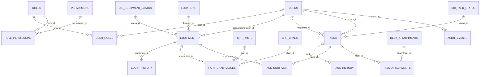

# Модель БД `ias_vniic` (схема `tech_accounting`)

## 1. Назначение

Документ определяет логическую и физическую модель базы данных `ias_vniic` (схема `tech_accounting`), разработанной на основе текущей схемы с расширением до полного покрытия ключевых требований ТЗ, включая:

- `5.1.4` Вложения по заявкам;
- `5.1.5` Контур учета активов;
- `5.1.6` Связь заявок с активами;
- `5.1.8` Поиск, фильтрация, сортировка;
- `5.1.10` Аудит и журналирование действий.

DDL-реализация размещена в файле `scripts/create_ias_vniic.sql`.

## 2. Логическая модель

### 2.1. Логические контуры

1. Контур управления доступом (RBAC):
   - `roles`, `permissions`, `role_permissions`, `users`, `user_roles`.

2. Контур нормативно-справочной информации:
   - `locations`, `dic_task_status`, `dic_equipment_status`, `spr_parts`, `spr_chars`, `nsi_change_log`.

3. Контур учета активов:
   - `equipment`, `equip_history`, `part_char_values`.

4. Контур заявок Help Desk:
   - `tasks`, `task_history`, `task_equipment`.

5. Контур вложений:
   - `desk_attachments`, `task_attachments`.

6. Контур аудита и эксплуатации:
   - `audit_events`, `import_runs`, `import_errors`.

### 2.2. Ключевые сущности и связи

- `users` M:N `roles` через `user_roles`.
- `roles` M:N `permissions` через `role_permissions`.
- `equipment` N:1 `dic_equipment_status`, N:1 `users` (ответственный), N:1 `locations`.
- `equip_history` N:1 `equipment`.
- `part_char_values` N:1 `equipment`, N:1 `spr_parts`, N:1 `spr_chars`.
- `tasks` N:1 `dic_task_status`, N:1 `users` (инициатор/исполнитель).
- `tasks` M:N `equipment` через `task_equipment`.
- `tasks` M:N `desk_attachments` через `task_attachments`.
- `task_history` N:1 `tasks`.
- `audit_events` фиксирует операции по всем типам объектов.

### 2.3. Логические правила целостности

1. Учет активов:
   - `equipment.inventory_number` является уникальным идентификатором актива.
   - `equipment.status_id` обязателен и ссылается на справочник статусов.

2. Заявки и активы:
   - связь реализована как M:N (`task_equipment`) для поддержки одного или нескольких активов в заявке.

3. Вложения:
   - связь с заявками нормализована через `task_attachments`;
   - допускается хранение legacy-данных в `tasks.attachments_legacy`.

4. Историчность:
   - изменения ключевых атрибутов заявок фиксируются в `task_history`;
   - события жизненного цикла активов фиксируются в `equip_history`.

5. Аудит:
   - события операций фиксируются в `audit_events`;
   - изменение или удаление записей `audit_events` запрещено триггером.

### 2.4. Покрытие требований ТЗ

| Требование ТЗ | Реализация в модели |
|---|---|
| 5.1.4 Вложения | `desk_attachments` + `task_attachments`, метаданные файла (тип, размер, загрузивший) |
| 5.1.5 Учет активов | `equipment` (инв. номер, серийный номер, статус, локация, ответственный), `equip_history`, `part_char_values` |
| 5.1.6 Связь заявок и активов | `task_equipment` (M:N) |
| 5.1.8 Поиск/фильтрация | индексы по инв. номеру, серийному номеру, статусу, локации, пользователю, времени |
| 5.1.10 Аудит | `audit_events` + запрет UPDATE/DELETE на уровне БД |

### 2.5. ER-диаграмма (логический уровень)

## 3. Физическая модель

### 3.1. Платформа и размещение

- СУБД: PostgreSQL.
- Имя БД: `ias_vniic`.
- Кодировка: `UTF8`.
- Схема: `tech_accounting`.

### 3.2. Правила физического проектирования

1. Ключи:
   - первичные ключи: `BIGSERIAL`;
   - внешние ключи: `BIGINT` + `REFERENCES`.

2. Временные атрибуты:
   - системные даты: `TIMESTAMPTZ`;
   - бизнес-даты (поступление/гарантия): `DATE`.

3. Поля структурированных изменений:
   - `JSONB` используется для `old_value/new_value`, `payload`, `details`.

4. Мягкое удаление и архив:
   - `is_deleted`, `is_archived`, `archived_at` применяются для сохранения истории.

5. Ограничения:
   - `UNIQUE` для бизнес-идентификаторов;
   - `CHECK` для перечислимых значений и базовой валидации.

### 3.3. Индексация (поиск и производительность)

Реализованы индексы для типовых сценариев:

- активы: `inventory_number`, `serial_number`, `lower(name)`, `(status_id, location_id, is_archived, is_deleted)`;
- заявки: `(status_id, created_at)`, `(executor_id, created_at)`, `(requester_id, created_at)`;
- связи: индексы на FK в `task_equipment`, `task_attachments`, `part_char_values`;
- аудит: `(event_time)`, `(actor_id, event_time)`, `(object_type, object_id)`, `(action_type, result_status)`.

### 3.4. Обеспечение неизменяемости аудита

Для таблицы `audit_events` используется триггер:

- `trg_audit_events_immutable` + функция `prevent_update_delete()`;
- результат: любые `UPDATE/DELETE` блокируются на уровне БД.

### 3.5. Протоколирование импорта/миграции

Для требований к протоколу импорта используются:

- `import_runs` (агрегированные итоги загрузки);
- `import_errors` (ошибки по строкам/записям).

## 4. Итог

Схема `ias_vniic` (tech_accounting) является расширением текущей модели и покрывает критичные разрывы исходной схемы по вложениям, активам, связям заявок с активами, поиску/фильтрации и аудиту. В результате модель пригодна для реализации полного объема приемки по указанным разделам `TZ.md`.
