# Парсинг ОУ_тест.xlsx, загрузка в БД: оценка, ETL и инструменты

Документ подготовлен по результатам анализа укороченной версии основного учёта **ОУ_тест.xlsx** и целевой схемы БД (ias_vniic / tech_accounting, DDL в `scripts/create_ias_vniic.sql`).

**Единый источник правил по столбцам и особым значениям (куда грузить, что не грузить, статусы вроде «Карточка оформлена»):** **[docs/РЕГЛАМЕНТ_ПАРСИНГА_ОУ_ТЕСТ.md](РЕГЛАМЕНТ_ПАРСИНГА_ОУ_ТЕСТ.md)**. Парсер/загрузчик должны следовать регламенту; при расхождении с данным документом приоритет у регламента.

---

## 1. Структура источника ОУ_тест.xlsx

### 1.1. Общие сведения

| Параметр | Значение |
|----------|----------|
| Файл | ОУ_тест.xlsx |
| Лист | **АРМ** (единственный лист) |
| Диапазон | 18 столбцов × 123 строки (1 строка заголовка + 122 строки данных) |

### 1.2. Заголовки столбцов (по порядку)

| № | Столбец в файле | Назначение |
|---|-----------------|------------|
| 1 | Пользователь | ФИО ответственного |
| 2 | Отдел | Подразделение / статус («Карточка оформлена») |
| 3 | Помещение | Кабинет, пост (103, 105, 701, «Пост охраны») |
| 4 | ЦП | Процессор |
| 5 | ОЗУ | Объём ОЗУ |
| 6 | Диск | Накопители (часто неатомарно: «SSD 480 ГБ\nHDD 500 ГБ») |
| 7 | Системный блок | Модель/наименование СБ |
| 8 | Пароль на BIOS, пользов. не админ, сложный пароль | Служебное (XXX, XX, _X_) |
| 9 | № системн. блока | Инв. номер СБ (иногда неатомарно: «БП-001223\nS/N R17042470073») |
| 10 | Дата закупки системного блока | Год, дата или текст («2022 (б/у)») |
| 11 | Монитор | Модель монитора (иногда два через \n) |
| 12 | № монитора | Инв. номер монитора |
| 13 | Дата закупки монитора | Год или дата |
| 14 | Имя | Имя ПК в сети (hostname) |
| 15 | IP адрес | IP или «не в сети», «DHCP (VLAN 214)» |
| 16 | ОС | ОС (Win10 Pro, Astra Linux и т.д.) |
| 17 | Антивирус | KES11, KES12 и т.д. |
| 18 | Другая техника | ИБП, принтер и т.д. |

### 1.3. Отличия от полного «Основной Учет.xlsx»

- В ОУ_тест **нет** столбцов: Наименование/тип техники, Поставщик, Дата поступления, Кому поставили, Примечание, отдельный «Инв. Номер».
- **Есть** дополнительные: «Пароль на BIOS…», «Дата закупки системного блока», «Дата закупки монитора», «Другая техника».
- **Один ряд** может описывать: (а) АРМ (ПК + опционально монитор в той же строке); (б) только монитор (строка без ЦП/ОЗУ/Диск/Системный блок — см. пример строки 10).
- Форматы дат в ячейках: год (2008, 2013), дата (18.06.2020, 07.06.2024), объект `datetime`, текст («2022 (б/у)», «Информтехника»).

---

## 2. Оценка парсинга и загрузки в БД

### 2.1. Удобство парсинга

| Аспект | Оценка | Комментарий |
|--------|--------|-------------|
| Структура листа | Хорошая | Один лист «АРМ», заголовки в первой строке, фиксированные столбцы. |
| Имена столбцов | Однозначные | На русском, без дубликатов; пробел в « IP адрес» — учесть при маппинге. |
| Объём | Умеренный | 122 строки — подходит для отладки ETL и повторных прогонов. |
| Неатомарные ячейки | Требуют правил | Разделители: `\n`, реже запятая. Столбцы: Диск, Монитор, № системн. блока, № монитора, даты закупки. |
| Форматы дат | Требуют нормализации | Год (число), DD.MM.YYYY, datetime, текст («2022 (б/у)») — нужен единый парсер с fallback. |
| Семантика строки | Требует решения | Одна строка = один актив (ПК или монитор) или два (ПК + монитор)? Рекомендация: одна строка = один equipment; при наличии и СБ, и монитора в строке — один equipment с inventory_number от № системн. блока, данные монитора — в part_char_values или description. Строки «только монитор» — отдельная запись equipment с inventory_number из № монитора. |

**Итог:** парсинг и загрузка **реализуемы без избыточной сложности**. Основные риски: разнообразие форматов дат и неатомарные ячейки; их нужно обрабатывать по зафиксированным правилам (см. п. 4 и `docs/СТРУКТУРА_ЛИСТА_АРМ_ОСНОВНОЙ_УЧЕТ.md`).

### 2.2. Маппинг столбцов ОУ_тест → целевая БД

Целевая схема: **tech_accounting** в БД **ias_vniic** (DDL: `scripts/create_ias_vniic.sql`).

| Данные ОУ_тест | Таблица/поле БД | Правило |
|----------------|-----------------|---------|
| Пользователь | users.full_name → equipment.responsible_user_id | Поиск по full_name; при отсутствии — создать пользователя с минимальными данными или пропустить (логировать). |
| Отдел | **Пока не загружаем** | В файле «Карточка оформлена» — статус (подписана ли карточка на оборудовании), не отдел. Решение по месту хранения не принято. См. регламент. |
| Помещение | locations.name → equipment.location_id | Нормализация: привести к строке (103 → «103», «Пост охраны» — как есть); поиск или создание локации (location_type = «кабинет» или «другое»). |
| № системн. блока | equipment.inventory_number | Если строка описывает ПК — использовать этот столбец (при неатомарности — первая подстрока или конкатенация). |
| № монитора | equipment.inventory_number | Если строка «только монитор» (нет СБ) — инв. номер из этого столбца. |
| Системный блок / Монитор | equipment.name, equipment.equipment_type | name: из «Системный блок» или «Монитор» + модель; equipment_type: «Системный блок», «Ноутбук», «Моноблок», «Монитор» и т.д. |
| ЦП, ОЗУ, Диск, Монитор, ОС, IP адрес, Имя, Антивирус | part_char_values + spr_parts + spr_chars | Справочники типов частей и характеристик; неатомарные значения — по правилам из п. 4. |
| Дата закупки системного блока / монитора | equipment.purchase_date, equipment.commissioning_date | После парсинга даты: purchase_date — дата закупки СБ; при одной дате можно дублировать в commissioning_date или оставить NULL. |
| Другая техника | equipment.description или part_char_values | Кратко в description или отдельная запись в part_char_values. |
| Поставщик | equipment.supplier | В ОУ_тест нет — оставить NULL или подставлять по регламенту. |

**Обязательные поля equipment:** inventory_number, name, status_id, location_id. Инв. номер формировать из № системн. блока или № монитора; при отсутствии обоих — пропускать строку и логировать.

---

## 3. ETL-диаграмма

Ниже — логическая схема процесса извлечения, преобразования и загрузки данных из ОУ_тест.xlsx в БД ias_vniic (схема tech_accounting).

```mermaid
flowchart LR
    subgraph Sources["Источники"]
        EXCEL["ОУ_тест.xlsx\n(лист АРМ)"]
    end

    subgraph Extract["Extract"]
        R1[Чтение листа АРМ]
        R2[Заголовки → маппинг столбцов]
        R3[Строки данных → буфер]
    end

    subgraph Transform["Transform"]
        T1[Нормализация локаций\nПомещение → locations]
        T2[Нормализация пользователей\nПользователь → users]
        T3[Парсинг дат\nгод/дата/текст → DATE]
        T4[Разбор неатомарных ячеек\nДиск, Монитор, № СБ/монитора]
        T5[Определение типа строки\nПК / только монитор]
        T6[Формирование записей equipment\nи part_char_values]
        T7[Валидация FK и дубликатов\nинв. номер]
    end

    subgraph Load["Load"]
        L1[Загрузка/обновление\nlocations]
        L2[Загрузка/обновление\nusers]
        L3[Загрузка/обновление\nspr_parts, spr_chars]
        L4[Вставка equipment\nbatch]
        L5[Вставка part_char_values]
        L6[Вставка equip_history\nпри наличии дат]
    end

    subgraph Target["Целевая БД (ias_vniic, tech_accounting)"]
        DB[(locations\nusers\nequipment\npart_char_values\nequip_history)]
    end

    EXCEL --> R1 --> R2 --> R3
    R3 --> T1 --> T2 --> T3 --> T4 --> T5 --> T6 --> T7
    T7 --> L1 --> L2 --> L3 --> L4 --> L5 --> L6 --> DB
```



### 3.1. Последовательность этапов ETL

| Этап | Действие | Инструмент/реализация |
|------|----------|------------------------|
| **E** | Открыть ОУ_тест.xlsx, лист «АРМ», прочитать заголовки и строки данных. | openpyxl или pandas (read_excel). |
| **T** | Нормализовать «Помещение» (тип, приведение к строке), создать/найти locations. | Словарь или запрос к БД по name. |
| **T** | Нормализовать «Пользователь» (ФИО), создать/найти users, заполнить department из «Отдел». | Аналогично по full_name. |
| **T** | Распарсить даты (год, DD.MM.YYYY, datetime, текст) в единый формат для purchase_date/commissioning_date. | Собственная функция или dateutil.parser с fallback. |
| **T** | Разобрать неатомарные ячейки (Диск, Монитор, № системн. блока, № монитора) по разделителям \n и запятая. | Строковый split, выбор первой подстроки или несколько записей part_char_values. |
| **T** | Определить для каждой строки: одна запись equipment (ПК или монитор), сформировать inventory_number, name, equipment_type. | По наличию заполненных столбцов (СБ vs только монитор). |
| **T** | Проверить дубликаты по inventory_number и валидность location_id, responsible_user_id. | SELECT перед INSERT или ON CONFLICT. |
| **L** | Вставить/обновить locations, users (с учётом FK). | INSERT … ON CONFLICT или предварительный SELECT. |
| **L** | Заполнить spr_parts, spr_chars при необходимости. | INSERT при отсутствии. |
| **L** | Вставить equipment (пакетами), затем part_char_values, при наличии дат — equip_history. | cursor.executemany или COPY. |

---

## 4. Инструменты

### 4.1. Рекомендуемый стек для ETL

| Назначение | Инструмент | Версия/примечание |
|------------|------------|-------------------|
| Чтение Excel | **openpyxl** или **pandas** | openpyxl — без зависимостей от научного стека; pandas — удобно для табличной обработки и очистки. |
| Подключение к PostgreSQL | **psycopg2** или **asyncpg** | psycopg2 — синхронный, достаточен для пакетной загрузки. |
| Парсинг дат | **dateutil.parser** или собственная логика | Учесть форматы: год (int), DD.MM.YYYY, datetime, текст («2022 (б/у)») — при неудаче оставлять NULL и логировать. |
| Логирование и отчёт об ошибках | **logging**, при необходимости **import_runs / import_errors** | Таблицы import_runs и import_errors уже есть в целевой схеме — использовать для протокола загрузки. |
| Запуск | CLI-скрипт (Python) или консольная команда (PHP/Yii2) | Рекомендация: отдельный Python-скрипт в `scripts/` (например, `load_ou_test.py`) для воспроизводимости и тестов на ОУ_тест. |

### 4.2. Варианты реализации

| Вариант | Плюсы | Минусы |
|---------|--------|--------|
| **Python-скрипт** (openpyxl/pandas + psycopg2) | Быстрая разработка, удобная обработка дат и строк, повторные прогоны на ОУ_тест. | Отдельный runtime; при эксплуатации только на PHP потребуется вызов из PHP (exec/shell) или дублирование логики. |
| **PHP** (PhpSpreadsheet + PDO/pg) | Единый стек с приложением, возможность веб-интерфейса загрузки. | Более трудоёмкий парсинг дат и неатомарных ячеек. |
| **Гибрид** | Python только для Extract+Transform (CSV/JSON), PHP или SQL — Load. | Два артефакта, согласование формата промежуточного файла. |

**Рекомендация:** на первом этапе реализовать ETL в виде **Python-скрипта** в `scripts/` (например, `load_ou_test.py`), с конфигурируемыми путями к файлу и БД и записью в import_runs/import_errors. После стабилизации правил парсинга при необходимости перенести логику в PHP (консольная команда Yii2 или отдельный экран импорта).

### 4.3. Зависимости (Python)

```text
openpyxl>=3.0.0
psycopg2-binary>=2.9.0
python-dateutil>=2.8.0
```

Опционально: **pandas** для упрощения трансформаций (фильтрация, группировка).

---

## 5. Обработка неатомарных ячеек и дат (кратко)

- **Неатомарные ячейки:** разделители `\n`, запятая. Для полей, уходящих в **equipment** (inventory_number, name), брать первую подстроку или конкатенировать по регламенту. Для характеристик (**part_char_values**) — либо одна запись с полным value_text, либо несколько записей по подстрокам (см. `docs/СТРУКТУРА_ЛИСТА_АРМ_ОСНОВНОЙ_УЧЕТ.md`).
- **Даты:** год (целое число) → 01.01.YYYY; строка DD.MM.YYYY → парсить; объект datetime → брать date(); текст («2022 (б/у)», «Информтехника») → не парсить, оставить NULL и при необходимости положить исходный текст в description.

---

## 6. Резюме

| Вопрос | Ответ |
|--------|--------|
| **Парсинг ОУ_тест.xlsx** | Реализуем; один лист «АРМ», 18 столбцов, 122 строки; нужны правила для дат и неатомарных ячеек. |
| **Загрузка в БД** | Целевая схема tech_accounting (ias_vniic) достаточна; маппинг столбцов определён; порядок загрузки: locations → users → equipment → part_char_values → equip_history. |
| **ETL** | Extract — чтение Excel; Transform — нормализация локаций/пользователей, парсинг дат, разбор неатомарных полей, валидация; Load — вставка с учётом FK и дубликатов. |
| **Инструменты** | Python: openpyxl (или pandas), psycopg2, dateutil; опционально — PHP для интеграции в приложение. |

Дальнейшие шаги: зафиксировать в коде маппинг заголовков ОУ_тест (в т.ч. пробел в « IP адрес»), реализовать скрипт загрузки с протоколом в import_runs/import_errors и при необходимости расширить документ после первого прогона на реальных данных.
