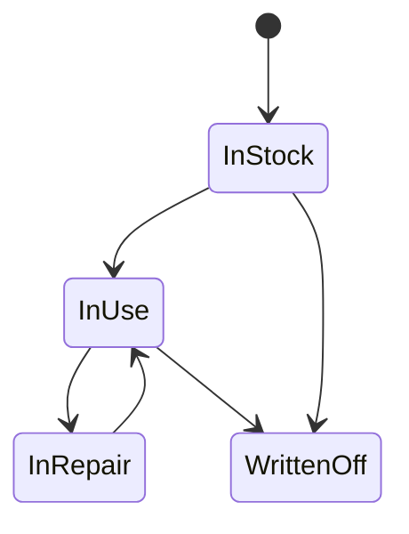

# Домен: учёт технических средств (Assets/Equipment)

Цель документа: описать **минимально достаточный** контур учёта ТС, чтобы после стабилизации Help Desk можно было развивать активы без «перепридумывания» модели.

## 1) Что считаем активом

Актив (оборудование) — это единица техники, которая:
- имеет уникальные идентификаторы (инвентарный/серийный),
- находится в локации,
- может быть закреплена за пользователем/подразделением,
- имеет события жизненного цикла (постановка, перемещение, ремонт, списание).

## 2) Минимальные сущности (MVP)

### 2.1. Equipment (Оборудование)

Обязательные поля (рекомендуемые):
- `inventory_number` (инвентарный номер) — UNIQUE
- `serial_number` (серийный номер) — UNIQUE (или UNIQUE вместе с типом)
- `name` (человекочитаемое имя)
- `asset_type` (тип: ПК/ноутбук/принтер/…)
- `model` / `vendor` (опционально)
- `status` (в эксплуатации/на складе/в ремонте/списано)
- `location` (FK)
- `assigned_to` (FK User, nullable)
- `purchase_date`, `commissioning_date`, `warranty_until` (опционально)

### 2.2. Location (Локация)

Справочник мест (кабинеты/склады/серверные).

### 2.3. EquipmentHistory (История)

События:
- `ASSIGN` / `UNASSIGN`
- `MOVE`
- `REPAIR_START` / `REPAIR_END`
- `WRITE_OFF`

Поля:
- `equipment_id`
- `changed_by`
- `event_type`
- `payload` (JSON: что изменили)
- `created_at`

## 3) Жизненный цикл (упрощённо)

## 4) Связь Help Desk ↔ Активы

Минимальный вариант:
- В `Task` добавить nullable FK `equipment` (или M2M, если задача может касаться нескольких активов).

Рекомендуемый вариант:
- M2M `TaskEquipment`, чтобы одна заявка могла ссылаться на несколько активов и/или комплектующих.

## 5) Как продолжать после Help Desk

Шаги:
- уточнить обязательные идентификаторы актива (инвентарный/серийный/штрихкод);
- определить статусы и регламент, кто и что может менять (RBAC);
- реализовать импорт активов (CSV/XLSX);
- добавить отчёты по: гарантиям, ремонту, перемещениям, списанию.

