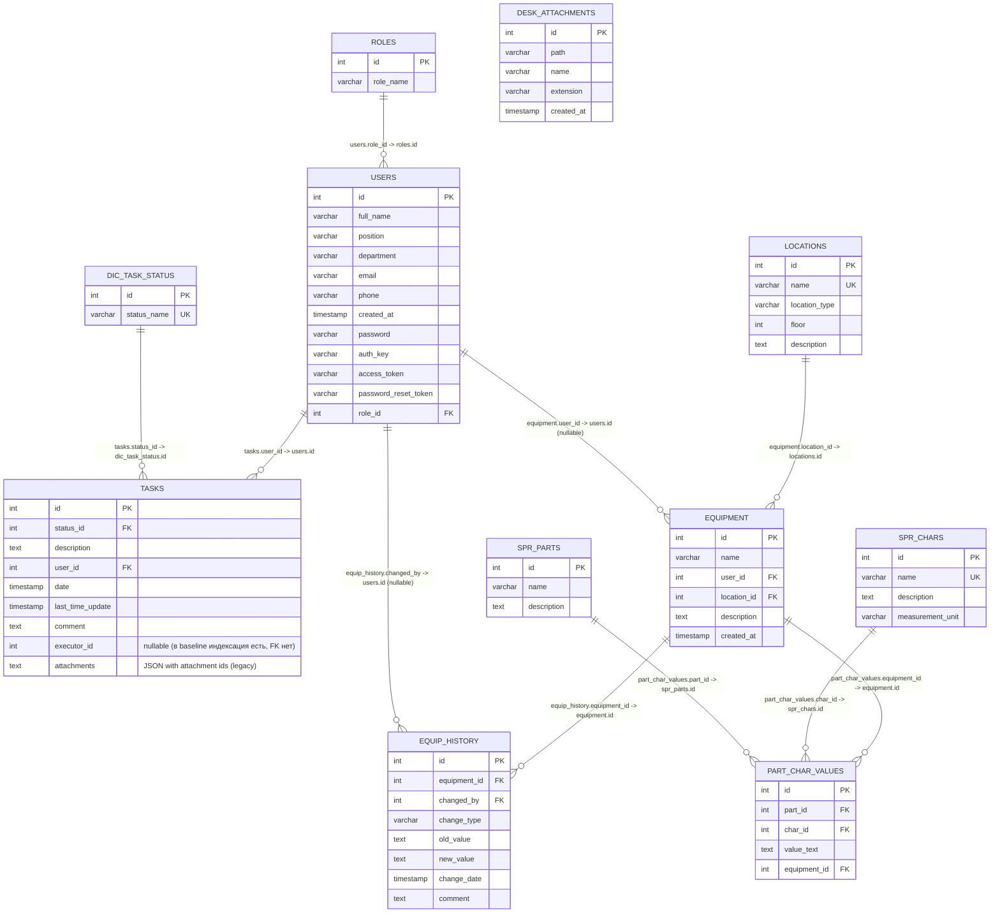

# Фаза 1 — ERD (черновик)

Ниже — ER-диаграмма **baseline-схемы `ias_vnii`** (см. `PHASE1_DB_BASELINE.md`).

Примечание:
- В legacy/базовой БД связь заявок и вложений хранится как JSON в `tasks.attachments` (тип `text`).
- В целевой Django-схеме это будет нормализовано (таблица связи `task_attachments`), но на Фазе 1 фиксируем текущее состояние и план изменения.

## ERD (Mermaid)

## Что нужно уточнить/дополнить в Фазе 1

- `tasks.executor_id`: в baseline есть индекс, но в схеме, которую мы сняли, нет FK на `users.id`. Нужно проверить, так ли это в реальной БД (возможна разница между схемами/миграциями).
- Связь `tasks.attachments` → `desk_attachments`: хранится JSON-строкой, нужно подтвердить формат (массив int? структура объектов?).

